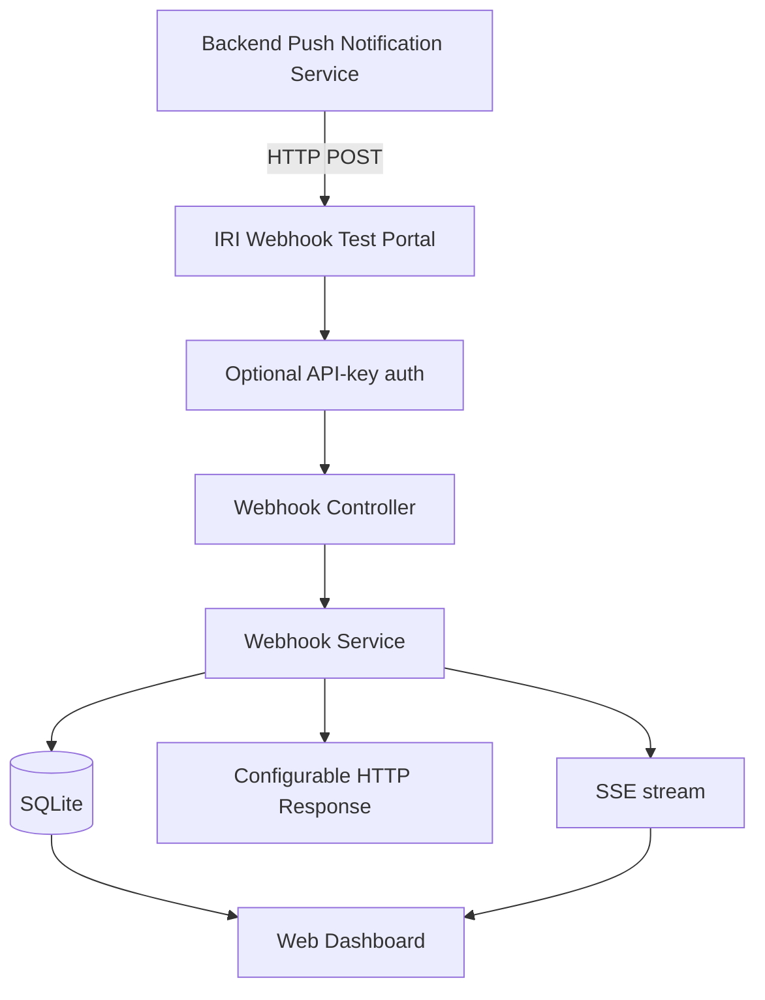

# IRI Push Notification Test Portal

Internal test harness / dummy webhook receiver for IRI Application Status Push Notifications (v1).

This application is **not** a carrier integration and does **not** contain business logic. It exists so the backend delivery team can send IRI push notification POSTs, inspect payloads, simulate HTTP failures and delays, and demonstrate the flow internally.

The official IRI specification is the source of event names and payloads:

https://specs.dfa.irionline.org/api-viewer.html?api=appstatuspushNotifications&version=v1

Local copy: `appstatuspushNotifications_1.1.0.yaml`

Event catalogue: `config/iri/v1/events.json`

---

## 1. Purpose

- Receive IRI Push Notification POST requests
- Test all current catalogue events and unknown/future events
- Persist and inspect every request
- Simulate success, failure, retry, and timeout responses
- View activity in a web UI

## 2. Architecture



Responsibilities stop at: receive, authenticate (optional), store, display, return a configurable response.

## 3. Technology stack

| Layer | Choice |
|---|---|
| Backend | Node.js, TypeScript, Express |
| Frontend | React, TypeScript, Vite |
| Database | SQLite (`better-sqlite3`) |
| Real-time | Server-Sent Events |
| Docs | Swagger UI at `/api-docs` |

## 4. Project structure

```text
src/                         Backend
  api/controllers/
  api/routes/
  api/middleware/
  services/
  repositories/
  database/
  config/
  types/
  utils/
  app.ts
  server.ts
  openapi.ts
frontend/                    React dashboard
config/iri/v1/events.json    IRI event catalogue
tests/
Dockerfile
docker-compose.yml
```

## 5. Local setup

```bash
cp .env.example .env
npm install
npm install --prefix frontend
npm run dev
```

This starts:

- API / webhook receiver: http://localhost:3000
- UI (Vite): http://localhost:5173

Production-style (UI served by Express after a frontend build):

```bash
npm run build --prefix frontend
npm start
```

Then open http://localhost:3000

## 6. Environment variables

| Variable | Default | Purpose |
|---|---|---|
| `PORT` | `3000` | API port |
| `PUBLIC_BASE_URL` | `http://localhost:3000` | URL shown in the UI / curl examples |
| `DATABASE_PATH` | `./data/webhook-events.db` | SQLite file |
| `IRI_VERSION` | `v1` | Catalogue folder under `config/iri/` |
| `WEBHOOK_RESPONSE_STATUS` | `200` | Default simulated HTTP status |
| `WEBHOOK_RESPONSE_DELAY_MS` | `0` | Default simulated delay |
| `WEBHOOK_AUTH_ENABLED` | `false` | Require `X-API-Key` on `POST /webhooks/iri` |
| `WEBHOOK_API_KEY` | empty | API key when auth is enabled |
| `CORS_ORIGIN` | `*` | CORS allow list (`*` or comma-separated origins) |
| `BODY_LIMIT` | `1mb` | JSON body size limit |
| `RATE_LIMIT_WINDOW_MS` | `60000` | Webhook rate-limit window |
| `RATE_LIMIT_MAX` | `300` | Max webhook requests per window |

Response status and delay can also be changed at runtime from **Settings** without restarting.

## 7. Webhook endpoint

```text
POST /webhooks/iri
Content-Type: application/json
```

One generic endpoint accepts every IRI event. Do not create per-event routes.

Event identity comes from the IRI `eventType` field, for example:

`applicationStatus.v1.applicationReceived`

Unknown event types are **accepted and stored**. They appear in the UI as `Unknown/Future Event`.

Default success response:

```json
{
  "status": "received",
  "message": "Webhook received successfully",
  "eventId": "<internal-event-id>"
}
```

## 8. API endpoints

| Method | Path | Purpose |
|---|---|---|
| `POST` | `/webhooks/iri` | Receive webhook |
| `GET` | `/health` | Health check |
| `GET` | `/api/webhook-events` | List stored requests |
| `GET` | `/api/webhook-events/:id` | Event detail |
| `DELETE` | `/api/webhook-events` | Clear stored requests |
| `GET` | `/api/stats` | Dashboard counters |
| `GET` | `/api/events` | IRI catalogue |
| `GET` | `/api/events/:eventType` | Catalogue item + sample payload |
| `GET` | `/api/config` | Runtime config |
| `PUT` | `/api/config` | Change simulated status/delay |
| `GET` | `/api/stream` | SSE feed of new webhooks |
| `GET` | `/api-docs` | Swagger UI |

## 9. Curl examples

Health:

```bash
curl http://localhost:3000/health
```

Valid webhook:

```bash
curl -X POST http://localhost:3000/webhooks/iri \
  -H "Content-Type: application/json" \
  -d '{
    "eventId": "evt-550e8400-e29b-41d4-a716-446655440001",
    "policyNumber": "P987654321",
    "id": "APP-2026-001234",
    "applicationOrigin": {
      "platform": "DigitalFirst",
      "isElectronic": true,
      "id": "DF-APP-001234"
    },
    "status": "received",
    "eventType": "applicationStatus.v1.applicationReceived",
    "notification": {
      "cusip": "401B23458",
      "isActionNeeded": false,
      "productName": "Secure Income Annuity Plus"
    }
  }'
```

Unknown/future event:

```bash
curl -X POST http://localhost:3000/webhooks/iri \
  -H "Content-Type: application/json" \
  -d '{"eventType":"applicationStatus.v9.brandNewEvent","policyNumber":"FUTURE-001"}'
```

With API key (when `WEBHOOK_AUTH_ENABLED=true`):

```bash
curl -X POST http://localhost:3000/webhooks/iri \
  -H "Content-Type: application/json" \
  -H "X-API-Key: test-token" \
  -d '{"eventType":"applicationStatus.v1.applicationCompleted","policyNumber":"P987654321"}'
```

## 10. UI usage

Open http://localhost:5173 (dev) or http://localhost:3000 (production build).

| Page | Use |
|---|---|
| Dashboard | Stats, recent events, online status, copy webhook URL |
| Events | Filter by catalogue event type, policy, status, date, search |
| Event detail | Headers (secrets masked), payload JSON, response |
| Send Test Notification | Load IRI sample payload, edit, send, copy curl |
| Settings | Simulate 200/201/202/400/401/403/409/500/503 and delays |
| API Documentation | Swagger UI |

The dashboard updates in real time over SSE.

## 11. Event catalogue

`config/iri/v1/events.json` is generated from the IRI YAML. It is used for:

- UI event pickers
- Test payloads
- Developer reference
- Filtering
- Documentation

The webhook receiver does **not** reject events missing from this file.

Future IRI versions can be added as `config/iri/v2/events.json` and selected with `IRI_VERSION=v2`. Webhook processing itself is version-agnostic.

## 12. Failure simulation

From Settings or `PUT /api/config`:

```json
{ "responseStatus": 500, "responseDelayMs": 1000 }
```

Typical test:

1. Backend POST → portal
2. Portal returns 500 after the configured delay
3. Backend retry / timeout logic runs

## 13. Authentication

Optional. Enable with:

```bash
WEBHOOK_AUTH_ENABLED=true
WEBHOOK_API_KEY=test-token
```

Send `X-API-Key: test-token`. Authorization and API key headers are masked in logs and the UI (`Bearer ********` / `********`).

Internal `/api/*` routes are unauthenticated; this is an internal tool.

## 14. Docker deployment

```bash
cp .env.example .env
docker compose up --build
```

SQLite is stored in the `webhook-data` volume (`/app/data/webhook-events.db`).

Webhook URL: http://localhost:3000/webhooks/iri  
UI: http://localhost:3000  
Swagger: http://localhost:3000/api-docs

## 14b. AWS public host

Dedicated EC2 (Elastic IP, port 80, API key required): see [`deploy/aws/README.md`](deploy/aws/README.md).

Launch `deploy/aws/cloudformation.yaml` from the AWS Console with an admin user. The CLI user `altzorAWS` does not currently have EC2/Lightsail create permission.

## 15. Testing

```bash
npm test
```

Coverage includes:

1. POST valid webhook
2. POST invalid JSON
3. POST without authentication when auth is enabled
4. POST with valid authentication
5. Webhook persistence
6. GET events
7. GET event by ID
8. Delete events
9. Health endpoint
10. HTTP failure simulation
11. Response delay
12. Unknown/future event
13. Event catalogue loading

## 16. Future IRI version support

```text
config/iri/v1/events.json
config/iri/v2/events.json   # add when IRI publishes v2
```

Set `IRI_VERSION=v2` to point the UI and `/api/events` at the new catalogue. Incoming webhooks remain generic.

## Assumptions

- IRI identifies notification type with the payload field `eventType` (confirmed in the 1.1.0 YAML).
- Sample payloads in the catalogue are the YAML examples, not production data.
- Auth applies only to `POST /webhooks/iri`.
- Runtime status/delay changes are in-memory (reset on process restart to env defaults).
- `PUT /api/config` was added so the Settings page can change simulation behavior without a restart.
